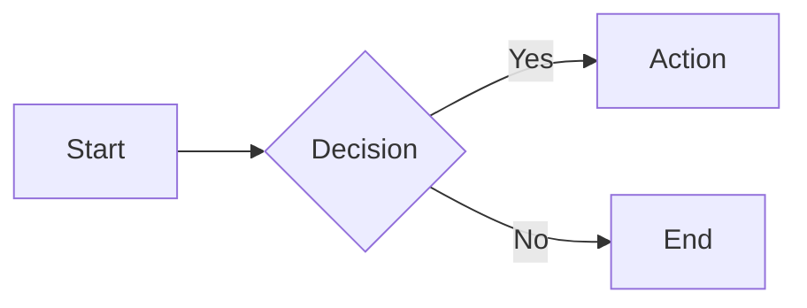

# Blocks

## Code Blocks

### Basic Code Block

```python
def hello_world():
    print("Hello, World!")
    return True
```

```{code-block} python
:caption: This is a caption for my code block!
def hello_world():
    print("Hello, World!")
    return True
```

### Code Block with Line Numbers

```{code-block} python
:linenos:
:emphasize-lines: 2

def calculate_sum(a, b):
    result = a + b
    return result
```

## Blockquotes

> Basic blockquote for quoted text.

> The best way to predict the future is to invent it.
>
> — Alan Kay

## Cards

:::{card} Card Title
Basic card with content.
:::

::::{grid} 2

:::{card} Card 1
First card.
:::

:::{card} Card 2
Second card.
:::

::::

## Grids

::::{grid} 3

:::{grid-item}
Column 1
:::

:::{grid-item}
Column 2
:::

:::{grid-item}
Column 3
:::

::::

## Dropdowns

:::{dropdown} Click to Expand
Hidden content inside dropdown.
:::

## Tabs

::::{tab-set}

:::{tab-item} Tab 1
Content for tab 1
:::

:::{tab-item} Tab 2
Content for tab 2
:::

::::

## Math

$$
\int_{-\infty}^{\infty} e^{-x^2} dx = \sqrt{\pi}
$$

## Mermaid



## IFrame

```{iframe} https://mystmd.org
:title: This is a test title

Here's an iframe with a title
```


## Topics

```{topic} Special Topic
This is a topic block. It's used to highlight special content or create a visually distinct section.
```

Regular content continues after the topic block.

````{topic} Another Topic
Topics can contain rich content:

- Lists
- **Bold text**
- `Code snippets`

```python
print("Code blocks too!")
```
````

## Containers

You can add classes to a div using inline syntax:

:::{div .border-l-4 .shadow}
This is a div with an inline class.
:::

Or using the `:class:` option:

:::{div}
:class: border-l-4 shadow

This is a div with a class specified via option.
:::

## Table of Contents

The `{toc}` directive generates a table of contents from headings that follow it on the page. The `:depth:` option controls how many heading levels to include.

With `:depth: 1`, only top-level headings are shown:

```{toc}
:depth: 1
```

With `:depth: 2`, subheadings are also included:

```{toc}
:depth: 2
```

With `:context: section`, only the section is included:

```{toc}
:context: section
```

## Glossary

```{glossary}
Term One
: Definition of the first term in the glossary.

Term Two
: Definition of the second term with more detail.

Term Three
: Another term with its definition.
```
