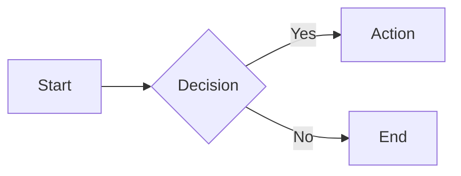

# Blocks

## Code Blocks

### Basic Code Block

```python
def hello_world():
    print("Hello, World!")
    return True
```

### Code Block with Line Numbers

```{code-block} python
:linenos:
:emphasize-lines: 2

def calculate_sum(a, b):
    result = a + b
    return result
```

## Blockquotes

> Basic blockquote for quoted text.

> The best way to predict the future is to invent it.
>
> — Alan Kay

## Cards

:::{card} Card Title
Basic card with content.
:::

::::{grid} 2

:::{card} Card 1
First card.
:::

:::{card} Card 2
Second card.
:::

::::

## Grids

::::{grid} 3

:::{grid-item}
Column 1
:::

:::{grid-item}
Column 2
:::

:::{grid-item}
Column 3
:::

::::

## Dropdowns

:::{dropdown} Click to Expand
Hidden content inside dropdown.
:::

## Tabs

::::{tab-set}

:::{tab-item} Tab 1
Content for tab 1
:::

:::{tab-item} Tab 2
Content for tab 2
:::

::::

## Math

$$
\int_{-\infty}^{\infty} e^{-x^2} dx = \sqrt{\pi}
$$

## Mermaid



## IFrame

```{iframe} https://mystmd.org
:title: This is a test title

Here's an iframe title
```